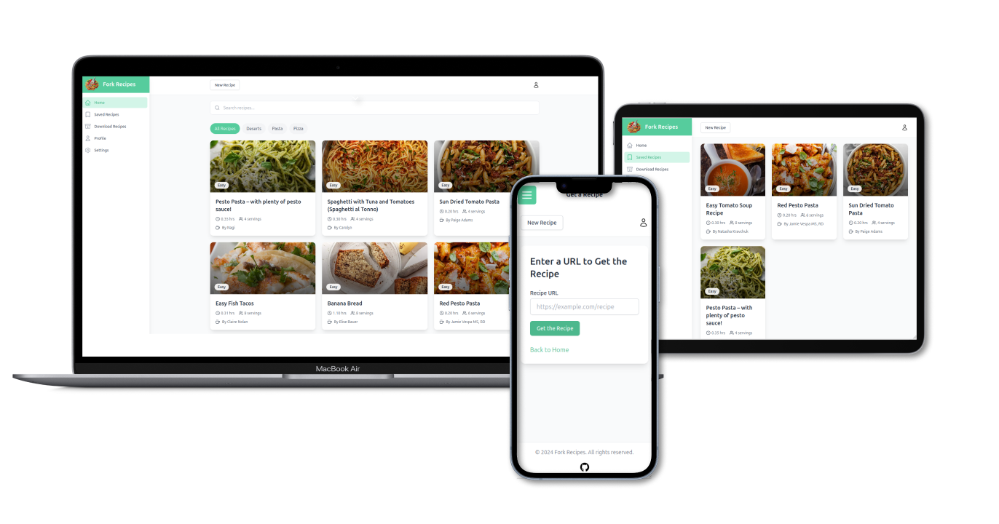

---
hide:
  - navigation
---

# Clients
---
<figure markdown="span">
  { width="710" }
</figure>
You can use already build FE clients together with the API. Currently, there are only a Web Application FE written in Python that can be deployed with Docker.

## Web application overview
You can follow the link of the official GitHub repository of the project here ➡ [follow me](https://github.com/mikebgrep/fork.recipes)

!!! note

    The FE client installation is independant from the ForkApi installation you don't need to follow the API installation instructions! <br>


## Installation

!!! info
    
      * To install the application you can use the SSL certificates that you own for your domain or just using domain without SSL.
      * To install on a home local server follwo the local deploy method.
      * The no SSL method can be handy when there an SSL certs setup by default by the hosting service or you just use the application locally.
      * *For installing on RaspberyPi you need to change in the docker compose file for the image for the `be` service to `mikebgrep/forkapi:arm64`*

##### Lets begin

1. You need to add all environment variables in `.env` file after you copied it from `.env.example`.
??? tip ".env"

    ```env
    # Secrets more info in documentation
    DJANGO_SECRET=
    X_AUTH_HEADER=
    
    # URL for the BE API requests must start with protocol http:// or https://
    SERVICE_BASE_URL=
    
    # Smtp settings
    EMAIL_HOST=
    EMAIL_HOST_USER=
    EMAIL_HOST_PASSWORD=
    EMAIL_PORT=
    EMAIL_USE_TLS=
    
    # Databse/SLL deployment type one of postgres, postgres-ssl, sqlite, sqlite-ssl
    DEPLOYMENT_TYPE=
    
    #Only if you use Posgress databse, format `postgres://user:password@ip:port/fork.recipes`
    DATABASE_URL=
   
    # Pagination for the recipe search endpoints
    PAGINATION_PAGE_SIZE=
   
    # Host address for the frontend to access media with protocol eg. https:.. (minimum two) with separated by comma
    CORS_ALLOWED_HOSTS=https://localhost,http://localhost
    
    # Scrape functionality make sure to add '' for the API KEY
    OPENAI_API_KEY=
    OPENAI_MODEL=gpt-4o-mini
   
    # Voice for TTS model one of alloy, ash, ballad, coral, echo, fable, onyx, nova, sage, shimmer
    OPEN_AI_TTS_MODEL_VOICE=coral
    ```
  There are comments for each section, but I will explain quick.

  * `DJANGO_SECRET` and `X_AUTH_HEADER` are mandatory as Django secret can be generated online from this tool ➡ [tool](https://djecrety.ir/) and the header should be something difficult to guest as a GUID  ➡ [tool](https://www.uuidgenerator.net/guid)
  * `SERVICE_BASE_URL` is the url that is used from the front end to communicate with the BE should be with `http://` or `https://` protocol.
  * Next are `SMTP settings` you can follow your email provider for the values I can say that only is used for reset password functionality so you may be will not need it

  * `CORS_ALLOWED_HOSTS` are the front end domain names
  * `OPENAI_API_KEY` is the API KEY from OpenAI for the scraping recipe functionality
  * `OPENAI_MODEL` is the default model at this stage the `gpt-4o-mini` is most cost-efficient and is working ok for the scraping task
  * `OPEN_AI_TTS_MODEL_VOICE` is the voice which is used for generating the audio recipes
  * `DEPLOYMENT_TYPE` is the choice of deployment eather with SSL support and different database type combined.
  * `DATABASE_URL` only if you use Postgres (already deployed).

!!! info "Postgres users"
    
    If you does not have Postgres deployed locally you can deploy it with `sudo docker compose up` command in the folder `postgres`. Make sure to change user and password env variables there.


!!! info "Read for local deploy without domain name"

    If you want to setup the application only for local use and you doesn't have a domain you can edit the `forkrecipes.nginx.conf` file and  change the port for `listen` at line `28` for the API, 
    after this you need to add the port in `nginx` service in the `docker-compose.yml` file.This way you can login to admin from the localhost and the port number. 
    Keep in mind that `SERVICE_BASE_URL` envirument variable should be also with the newly added port and the local ip of the host eg. `http://192.168.x.x:port`.

    ??? tip "docer-compose.yml nginx service"
            
          ```
          nginx:
            build:
              context: .
              dockerfile: nginx/Dockerfile
            container_name: nginx-fork-recipes
            ports:
              - "port-number:80"
              - "port-number:81"
          ```
    
    ??? tip "forkrecipes.nginx.conf"
            
        ```
        server {
            listen 80;
            server_name localhost;
            client_max_body_size 100M;
        
            location / {
                include /etc/nginx/uwsgi_params;
                uwsgi_pass unix:/tmp/uwsgi/uwsgi_recipes.sock;
            }
        
            location /static {
                autoindex on;
                alias /fork_recipes/static;
            }
        
            error_log /var/log/nginx/error.log;
            access_log /var/log/nginx/access.log;
        }

        server {
            listen 81;
            server_name localhost;
            client_max_body_size 100M;
        
            location / {
                include /etc/nginx/uwsgi_params;
                uwsgi_pass unix:/tmp/uwsgi/uwsgi.sock;
            }
        
            location /static {
                autoindex on;
                alias /forkapi/static;
            }
        
            location /media {
                autoindex on;
                alias /forkapi/media;
            }
        
            error_log /var/log/nginx/error.log;
            access_log /var/log/nginx/access.log;
        }
        ```

    !!! note
    
        This setup is valid for installation without SSL
        This setup is only for local use on home server!

2.Run docker compose
=== "No SSL"
    
    If you use domain names without SSL you must define them in `nginx/forkapi.nginx.conf` file in lines `3` for the FE and line `28` for the BE.

    ``` bash
    $ sudo chomd +x compose.sh
    $ sudo ./compose.sh up
    ```
    This command will install NGINX, ForkAPI and the Fork.Recipes.


=== "SSL"
    You need to have valid certificates for your domain and subdomain.This files should be copied in the `nginx/ssl` folder. The files are `fullchain.pem` and `privkey.pem` (names need to be the same).  
    Choice `DEPLOYMENT_TYPE` variable accordingly of the Database type `postgres-ssl` or `sqlite-ssl` <br>
    Add your domain names in `nginx/forkapi-ssl.nginx.conf` on lines `3` and `20` for the FE service and on line `11` and `51` for the BE service.
    ``` bash
    $ sudo chomd +x compose.sh
    $ sudo ./compose.sh up
    ```

3.You can access the API admin panel and the FE from the links added in the `nginx` configuration files 

4.Login into the app with the default user `email:admin@example.com`, `password:ChangeMe` you can update this values after the first login in Profile screen.
Currently, there no signup implemented so you can add another user is from the admin panel.

??? tip "compose.sh arguments"
    
    This is the available compose.sh arguments
    ``` bash
    $ sudo ./compose.sh 'up' #Start the containers
    $ sudo ./compose.sh 'down' #Remove the container
    $ sudo ./compose.sh 'down --volumes' #Remove the containers volumes
    $ sudo ./compose.sh 'build' #Build the images
    $ sudo ./compose.sh 'build --no-cache' #Build without cache
    ```


## Final thoughts
There a number of different options you can do as using different domain for the BE that is not subdomain of the FE domain name.
At this stage you can use the application and if you have any questions you can ask them in the repository. [fork.recipes](https://github.com/mikebgrep/fork.recipes)