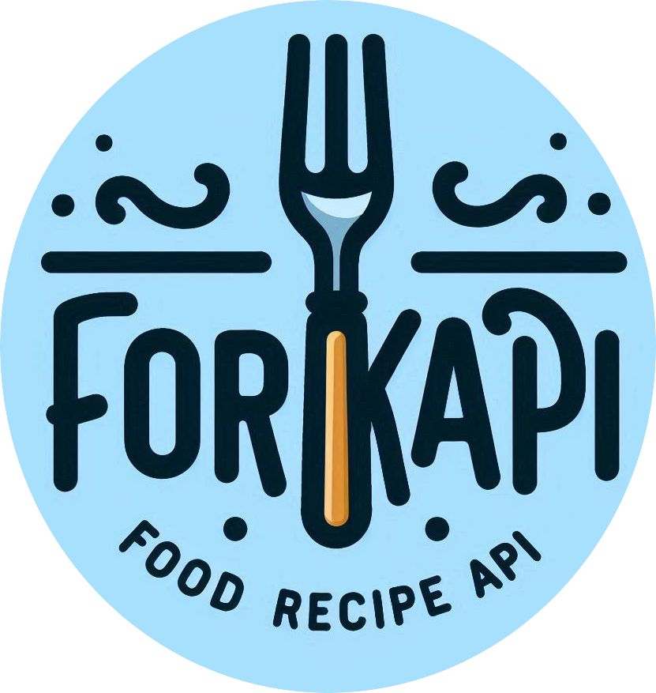

---
hide:
  - navigation
---

# ForkAPI

### *A lightweight RestAPI client that manage food recipies easily*

---
{ width="170" align="right"   }
ForkAPI is a Django drf based project which can be easily integrated as a backend service for a 
mobile application or web application that can display, add, favorite a food recipies.
The api is designed to be simple to use with build in Dashboard panel to add recipies manual
or using the provided endpoints (views in Django).

You can benefit for future support of the project.

[Get Started](user-guide.md){ .md-button .md-button--primary } [Installation](Installation.md){ .md-button .md-button--primary }

